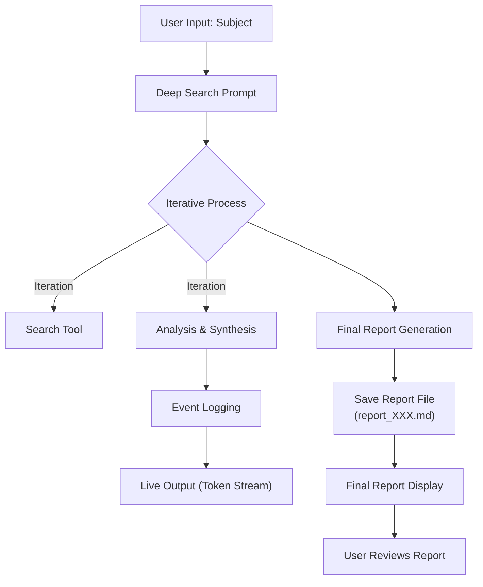
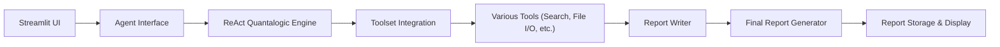

# Quantalogic Deep Search

**Quantalogic Deep Search** is a multi-source research analysis tool that uses the innovative ReAct AI Agent Quantalogic Principle to perform in-depth exploratory searches, synthesize results, and generate comprehensive reports—all via a user-friendly web interface.

---

## What Is This Tool About?

Quantalogic Deep Search harnesses the power of advanced language models and an agent-based design to:
- **Automate Complex Research Tasks:** Incrementally search, analyze, and synthesize diverse information sources.
- **Monitor Real-Time Progress:** View live output and detailed event logs that are organized in a collapsible, interactive tree view.
- **Generate Comprehensive Reports:** Produce uniquely named, markdown-formatted final reports (e.g., `report_001.md`) that encapsulate all research findings.

---

## How to Start

### Prerequisites
- **Python 3.12+** installed.
- **uv** installed (a versatile tool runner).
- Set your **OPENROUTER_API_KEY** environment variable appropriately.
- **SerpAPI Key:** Obtain a free API key from [SerpAPI](https://serpapi.com/) for web search functionality.
  ```bash
  # Set your SerpAPI key as an environment variable
  export SERPAPI_API_KEY=='your_serpapi_key_here'
  ```

  **Note:** Keep your SerpAPI key confidential. Do not commit it to version control. 
  Consider using a `.env` file or your system's environment variable management.

### Quick Start Guide

1. **Clone the Repository:**
   ```bash
   git clone https://github.com/yourusername/quantalogic-deep-search.git
   cd quantalogic-deep-search
   ```
2. **Make the Script Executable:**
   ```bash
   chmod +x app.py
   ```
3. **Run the Application:**
   ```bash
   uv run app.py
   ```
4. **Open the Web Interface:**
   Open the local URL (usually `http://localhost:8501`) displayed in your terminal.

---

## How It Works: The ReAct Quantalogic Principle

The tool is built on the **ReAct Quantalogic Principle**—a powerful framework that combines **Reasoning** and **Acting** in an iterative process:

1. **Reasoning:**  
   The agent reviews the search prompt, iteratively collects information from various sources, and refines its understanding of the subject matter.
   
2. **Acting:**  
   At each iteration, it interacts with specialized tools (e.g., search, file operations, analysis) to gather and process data, logging its actions and continuously improving the final result.

3. **Synthesis & Report Generation:**  
   After several iterative cycles, the agent synthesizes the findings into a final report in Markdown format, automatically naming it (e.g., `report_001.md`). The report is then displayed for your review.

### Mermaid Diagram: ReAct Quantalogic Workflow



### Architecture Overview



---

## Features

- **Iterative Deep Search:** Incremental refinement of search results through multiple tool interactions.
- **Real-Time Output Streaming:** Visualize the token stream and event logs as the agent processes your query.
- **Interactive Event Logs:** Collapsible and detailed, providing transparency into each step taken by the agent.
- **Automatic Report Generation:** Each search creates a unique Markdown report, viewable directly in the app.
- **User-Friendly Interface:** Designed with modern, responsive layouts for an engaging experience on any device.
  
---

## Setup and Usage

1. **Configure Environment:**  
   Set the `OPENROUTER_API_KEY` in your environment:
   ```bash
   export OPENROUTER_API_KEY=your_api_key_here
   ```
2. **Run the Application:**  
   Follow the [Quick Start Guide](#how-to-start) to launch the tool.
3. **Interact with the UI:**  
   - Enter a research subject.
   - Click **Start Search** to begin the deep search process.
   - Monitor the live output and collapsible event log tabs.
   - Once the task completes, switch to the **Final Report** tab to read the generated report.

---

## Contributing

Contributions and feedback are welcome!  
Feel free to:
- Open an issue for bugs or feature requests.
- Submit pull requests for improvements.

---

## License

Distributed under the MIT License. See `LICENSE` for more information.

---
